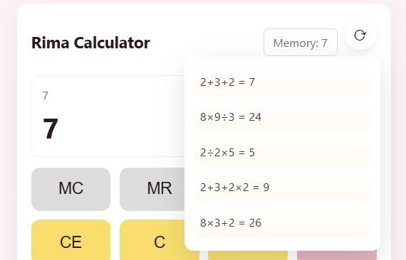

- Nama : Rima Dwi Puspitasari
- NPM : 2315061038
- Kelas PW-B

---

## Rima Calculator

Rima Calculator adalah aplikasi kalkulator berbasis web dengan tampilan modern dan fitur lengkap untuk perhitungan dasar maupun lanjutan.

---

## ✨ Fitur

### 🖥️ Interface Kalkulator
- Display untuk menampilkan angka & hasil  
- Tombol angka 0–9  
- Tombol operasi (+, -, ×, ÷)  
- Tombol Clear (C) & Clear Entry (CE)  
- Tombol Equals (=)  
- Tombol Decimal Point (.)

### ⚙️ Functionality
- Operasi aritmatika dasar (tambah, kurang, kali, bagi)  
- Perhitungan berantai (contoh: 5 + 3 × 2)  
- Penanganan error (misal: pembagian dengan nol)  
- Keyboard support (input angka & operator)

### 🚀 Advanced Features
- History perhitungan (5 terakhir)  
- Memory functions: **M+, M-, MR, MC**  
- Responsive design (mobile & desktop)

---

## 📸 Tampilan Aplikasi

### 🟣 Halaman Utama

### 🟡 Halaman History

